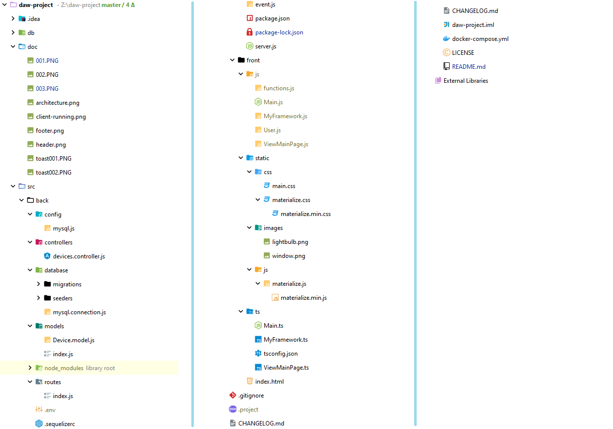
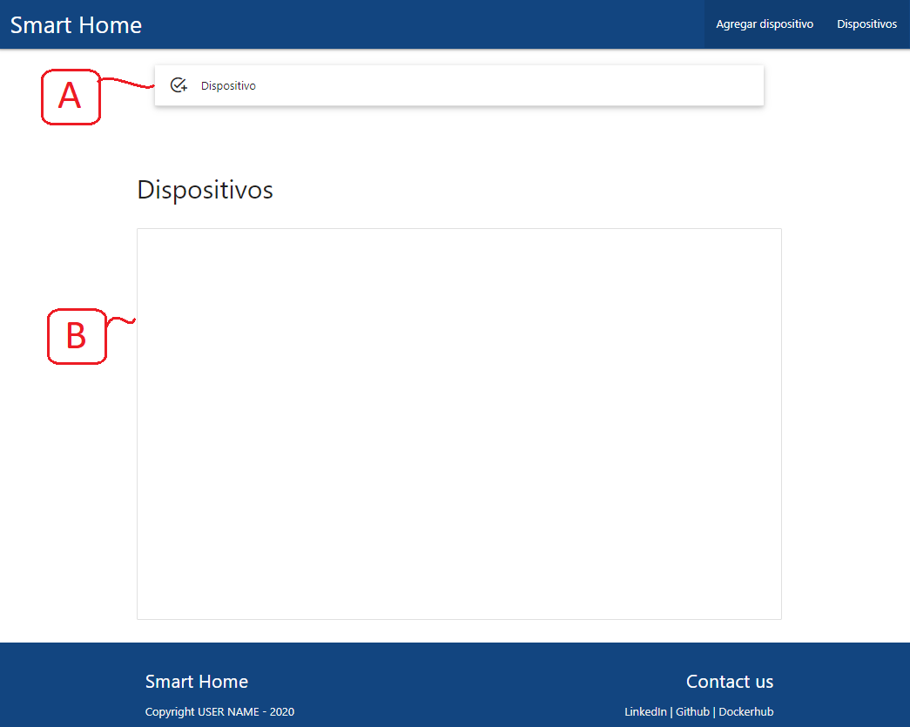
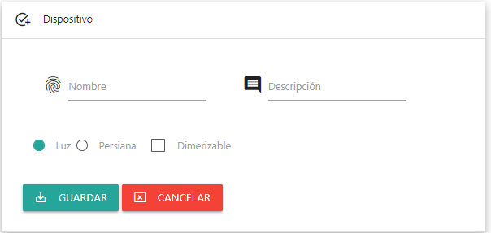
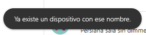
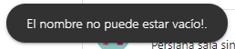
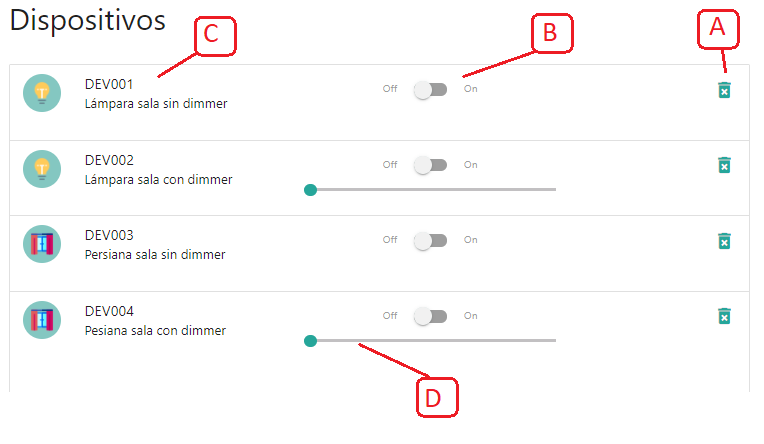
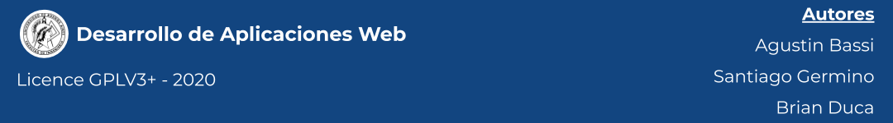

 

 

# TP Desarrollo de Aplicaciones Web
Trabajo práctico final de la asignatura Desarrollo de Aplicaciones Web de la Especialización en IOT de la Universidad de Buenos Aires.

Autor

* Ing. Katherine E. Aguirre

Docentes:

* Agustin Bassi
* Brian Ducca
* Santiago Germino

---

## Introducción

El presente es un desarrollo full stack que contempla la implementación de un sistema para el manejo de dispositivos IoT en el hogar a través de una Single Page Application. dicho proyecto fué elaborado en el marco de la asignatura Desarrollo de Aplicaciones Web de la cohorte Nro 3 en Internet of Things (3CEIoT) dictada en la Facultad de Ingeniería de la UBA.

Se recomienda leer la siguiente [Wiki 📖](https://github.com/ce-iot/daw-project-template/wiki) para realizar el proceso de arranque del código fuente en el servidor.

---

## Descripción del Proyecto

El proyecto se encuentra compuesto de dos partes, a saber: Backend y Frontend

Se encuentra estructurado de la siguiente manera:

---

### Front-End

El front-end cuenta con las siguientes tecnologías:
  * HTML5
  * Materialize UI
  * Typescript

El mismo cuenta con el siguiente look & feel:

* A: Formulario de inserción de dispositivos
* B: Scroll área para los dispositivos existentes

---

#### Formulario
El detalle del formulario de inserción es el siguiente:

Presenta dos input fields uno para el nombre y otro para la descripción del dispositivo, en la parte inferior presenta 
dos radio buttons para seleccionar el tipo, así mismo cuenta con un checkbox para indicar si el dispositivo en cuestión 
es dimerizable. Finalmente se presentan dos botones: uno para agregar el dispositivo y otro para cancelar la operación.

* Cabe destacar   que si el dispositivo a insertar ya se encuentra en la base de datos en siguiente toast se mostrará y no
se persistirá el dato:

* Por otro lado si se procede a insertar un registro vacío se mostrarpa el siguiente toast:

#### Scrolling área

Cada dispositivo registrado en la base de datos se muestra en esta sección, en la misma se puede apreciar lo siguiente:
* A: Botón de eliminar: se emplea para remover dispositivos de la base de datos.
* B: Botón de encendido/apagado del dispositivo.
* C: Área de descripción del dispositivo, se muestra el nombre, detalle e ícono representativo.
* D: Scroll bar: se emplea para dimerizar el dispositivo que cuente con dicha característica.

---

### Back-End
El backend cuenta con las siguientes tecnologías a destacar:

* express: ^4.17.1,
* lodash: ^4.17.20,
* mysql2: ^2.2.5,
* sequelize": ^5.21.6      
* sequelize-cli: ^6.2.0
---

#### Endpoints

---

### /devices

#### GET
##### Descripción

Obtener todos los dispositivos en la base de datos.

##### Parámetros

*No Aplica*

##### Responses

| Code | Descripción | Schema |
| ---- | ----------- | ------ |
| 200 |     Listado | {status: "ok", data: data } |
| 500 |     Error del servidor | {status: "bad", data: error.message} |

---

### /devices/{id}

#### GET
##### Descripción

Obtener un dispositivo de la base de datos.

##### Parámetros

| Nombre | Ubicación | Descripcion | Requerido | Type |
| ---- | ---------- | ----------- | -------- | ---- |
| id | path | El id del dispositivo | Si | number |

##### Responses

| Code | Descripción | Schema |
| ---- | ----------- | ------ |
| 200 |  Objeto creado    | {status: "ok", data: data } |
| 404 | No encontrado  | {status: "bad", data: message } |
| 500 |  Error en el servidor | {status: "bad", data: message} |

---

### /devices

#### POST
##### Descripción

Obtener un dispositivo de la base de datos.

##### Parámetros

| Nombre | Ubicación | Descripcion | Requerido | Type | Default |
| ---- | ---------- | ----------- | -------- | ---- | ---- |
| name | body | Nombre del dispositivo | Si | string | N/A |
| descripcion | body | Descripción del dispositivo | opcional | string | *empty* |
| state | body | Estado del dispositivo | opcional | number | off |
| type | body | tipo del dispositivo | opcional | number | lamp |
| dimerized | body | Indica si el dispositivo es dimerizable | opcional | number | no |
| dimer_value | body | Valor del dimmer | opcional | number | 0.0 |

##### Responses

| Code | Descripción | Schema |
| ---- | ----------- | ------ |
| 200 |  Objeto creado    | {status: "ok", data: data } |
| 400 | Nombre vacío  | {status: "bad", data: message } |
| 409 |  Dispositivo ya existente   | {status: "bad", data: message } |
| 500 |  Error en el servidor | {status: "bad", data: message} |

---

### /devices/{id}

#### PUT
##### Descripción

Actualizar un dispositivo de la base de datos.

##### Parámetros

| Nombre | Ubicación | Descripcion | Requerido | Type | Default |
| ---- | ---------- | ----------- | -------- | ---- | ---- |
| id | path | El id del dispositivo | Si | number | N/A |
| name | body | Nombre del dispositivo | no | string | previous |
| descripcion | body | Descripción del dispositivo | opcional | string | previous |
| state | body | Estado del dispositivo | opcional | number | previous |
| type | body | tipo del dispositivo | opcional | number | previous |
| dimerized | body | Indica si el dispositivo es dimerizable | opcional | number | previous |
| dimer_value | body | Valor del dimmer | opcional | number | previous |

##### Responses

| Code | Descripción | Schema |
| ---- | ----------- | ------ |
| 200 |    Dispositivo actualizado | {status: "ok", data: data } |
| 202 |     Aceptado pero No encontrado | {status: "bad", data: message } |
| 500 |     Error del servidor | {status: "bad", data: message} |

---

### /devices/{id}

#### DELETE
##### Descripción

Eliminar un dispositivo de la base de datos.

##### Parámetros

| Nombre | Ubicación | Descripcion | Requerido | Type | Default |
| ---- | ---------- | ----------- | -------- | ---- | ---- |
| id | path | El id del dispositivo | Si | number | N/A |

##### Responses

| Code | Descripción | Schema |
| ---- | ----------- | ------ |
| 200 |    Dispositivo actualizado | {status: "ok", data: data } |
| 202 |     Aceptado pero No encontrado | {status: "bad", data: message } |
| 500 |     Error del servidor | {status: "bad", data: message} |

---

## Licence

This project is published under GPLV3+ licence.

