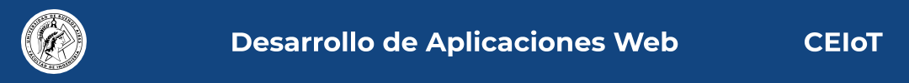

 

# TP Desarrollo de Aplicaciones Web

Autor

* Ing. Katherine E. Aguirre

Docentes:

* Agustin Bassi
* Brian Ducca
* Santiago Germino

Template project for Web Applications Development.

To read all project documentation, please go to its wiki in [this link](https://github.com/ce-iot/daw-project-template/wiki).

## Licence

This project is published under GPLV3+ licence.

